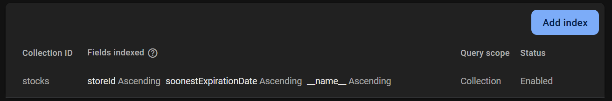

# Installation

After cloning the project, install dependencies using `pnpm`:

```bash
pnpm install
```

This project uses Firebase/Firestore, The credentials are required to be set in the `.env` file. rename the `.env.example` and add the proper credentials after creating a Firestore project. You won't need to setup anything except for one index.



## Running the API

After installing the dependencies. Run the server using:

```bash
pnpm dev
```

## Postman collection

import this collection JSON file `./mapeau-store.postman_collection.json` into Postman to view all the endpoints and test them.

## Health and security

The API is not robust or production ready. It's a mere prototyping of the stock management basic process. And the process itself is not complete to be used on the production level.

## Data models and Schema

the JSON schema files in the root folder `./schema.json`, `./schema.example.json` are the representation of the data structure of Firestore DB. The example file is to show how the data will be used and stored.
Finally, For more details about the schema, check `./schema.md`.
